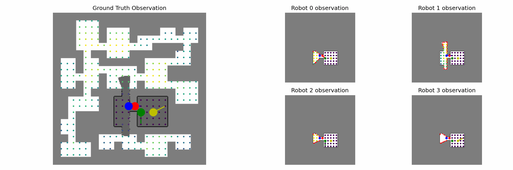
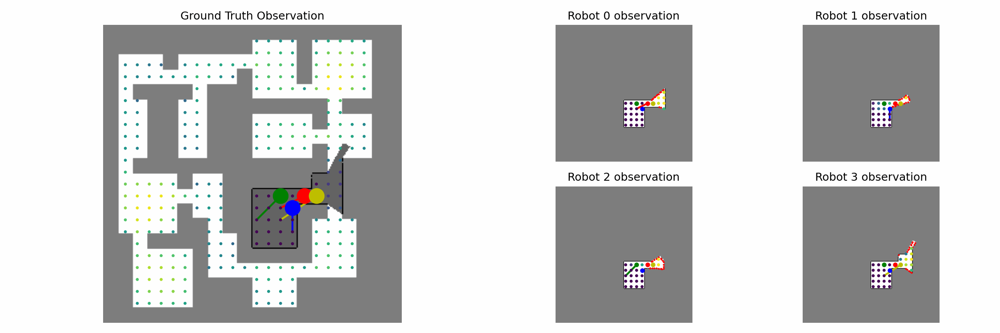
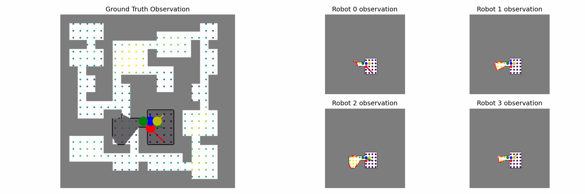
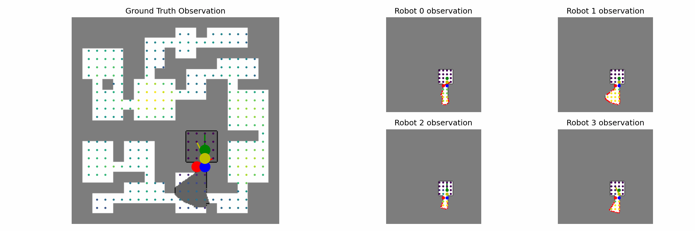

# Bandwidth-limited Multi-Robot Exploration

Public code of <a href="https://arxiv.org/abs/2407.20203">Privileged Reinforcement and Communication Learning for Distributed, Bandwidth-limited Multi-Robot Exploration</a>, which is accepted by DARS 2024.
 
This framework is extended form <a href="https://github.com/marmotlab/ARiADNE">ARiADNE</a>

## Run

#### Dependencies
* `python == 3.8`
* `pytorch == 2.3.1`
* `ray == 2.10.0`
* `scikit-image == 0.21.0`
* `scikit-learn == 1.3.2`
* `scipy == 1.10.1`
* `matplotlib == 3.7.5`
* `tensorboard == 2.14.0`

#### Training
1. Set training parameters in `parameters.py`.
2. Run `python driver.py`

#### Evaluation
1. Set parameters in `test_parameters.py`.
2. Run `test_driver.py`

### Demo

   
    
   
    
   
    
   

### Authors
[Yixiao Ma](https://yixiao-m.github.io)\
[Jingsong Liang](https://github.com/JingsongLiang)\
[Yuhong Cao](https://github.com/caoyuhong001)\
[Derek Ming Siang Tan](https://github.com/derektan95)\
[Guillaume Sartoretti](https://github.com/gsartoretti)
